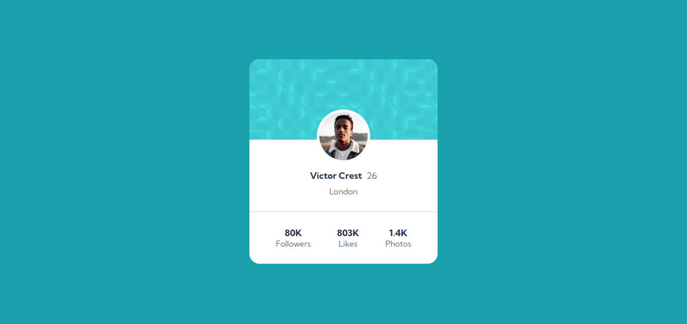

## Table of contents

- [Overview](#overview)
  - [The challenge](#the-challenge)
  - [Screenshot](#screenshot)
- [My process](#my-process)
  - [Built with](#built-with)
  - [What I learned](#what-i-learned)
  - [Continued development](#continued-development)

## Overview

This is one challenge of Frontend Mentor, a simple web page.

### The challenge

- Build out the project to the designs provided

### Screenshot

## My process

My process in this challenge was very easy to implement. I first layout my HTML and after I did the CSS.

### Built with

- Semantic HTML5 markup
- CSS custom properties
- Flexbox

### Continued development

I will continue development my skills about responsive design and flexbox-grid.

